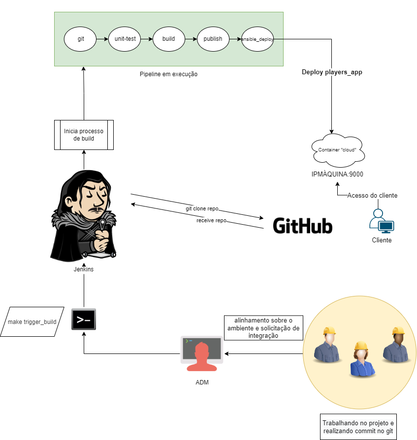

[](https://github.com/JustIdeas/ci_cd_alltheway/graphs/contributors) [](https://github.com/coderjojo/JustIdeas/ci_cd_alltheway/issues) [](https://github.com/JustIdeas/ci_cd_alltheway/pulls) [](https://github.com/JustIdeas/ci_cd_alltheway/) 

# Resumo sobre o projeto
A idéia deste projeto é a criação de um ambiente DebOps, utilizando do jenkins para a criação de uma pipeline na qual possui stages de git, test, build, publish e deploy, sendo o deploy realizado pelo ansible, com um playbook especifico.

# Requisítos de ambiente
Para rodar este repositório, será nescessário:
- Máquina Linux (preferencia ubuntu 22.04, pois foi o que usei em uma VM) com instalação padrão;
- Instalação do GIT e make;
- Todas as execuções do Makefile devem ser executadas na pasta raiz deste projeto, como também esteja como root (sudo su);

# Ambiente e suas particularidades
Todo o ambiente roda em containers, sendo um o jenkins e o outro uma máquina simulando um servidor na núvem (onde o ansible irá dar o deploy da infra). o volume mapeado para o jenkins é um volume fixo, no qual é realizado um download do volume compactado do drive e depois descompactado na pasta onde o volume do container jenkins está esperando. Além disto, o acesso ao servidor da núvem só é feito por quem tem a chave ssh privada, não sendo permitido outro tipo de acesso.

## Responsabilidade dos scripts e detalhes sobre os arquivos e pastas
### *Makefile*
Primeiro script a ser executado após clone do repositório. Irá instalar o docker, dar permissionamento nos arquivos nescessários para rodar "docker in docker" e irá realizar o download do volume fixo do jenkins. 
Detalhe que em um ambiente de produção, geralmente se mapeia no próprio host o volume ou em algum servidor de arquivos, só utilizei desta forma para que o tudo rodasse em um único local não considerando espaço em núvem e nem que o usuário deste projeto fosse realizar toda a configuração manualmente.

Neste MakeFile existe algumas funções, sendo elas

```docker_install``` - Prepara o ambiente instalando o Docker e suas dependências;

```unpack_jenkinshome``` - Baixa e descompacta o volume do Jenkins no diretório correto do projeto, além de alterar as permissões;

```permissions``` - Altera as permissões da chave privada e do docker.sock (para rodar como docker In docker);

```docker_build``` - Realiza o build do projeto, baixando as imagens de repositórios públicos e instalando suas dependências para execução;

```bringup``` - Sobe os containers em detach;

```trigger_build``` - Realiza uma chamada POST para o Jenkins, onde dispara o build da pipeline;

```bringdown``` - Derruba os containers.

Além disto, existe uma variável chamada ```IP_PORT_JK```, na qual deve ser alterada para o ip da interface de acesso da máquina ou VM que o projeto está rodando.

### Arquivo *Docker_compose.yml*
Para subir o ambiente como um todo, deve ser executado o docker-compose passando este arquivo, com o parâmetro build. Desta forma, todas as imagens nescessárias do jenkins e da aplicação cloud (local) irá ser realizado de forma automática (cada projeto possui um Dockerfile).
Importante salientar que para que o "docker in docker" funcione corretamente, é nescessário mapear o docker.sock do host com o do container, e dar suas permissões.

### Arquivo *jenkinsfile*
A pipeline criada no jenkins utiliza como base este arquivo (após o clone do repositório pela própria pipeline) para realizar as tasks definidas em cada etapa, sendo eltas ```GIT```, ```unit-test```, ```build```, ```publish``` e ```ansible_deploy```. Para mais detalhes, no arquivo contém comentários sobre cada stage

### Pasta *ansible_play*
Neste diretório contem os arquivos nescessários para que o ansible-playbook consiga realizar o deploy da aplicação no container cloud. A conexão realizada entre o jenkins e o servidor é realizada via SSH com uma private_key, limitando o acesso somente ao jenkins ou qualquer outro ADM que queira utilizar da mesma chave para acesso ao servidor, porém recomendo que cada um tenha sua chave privada separadamente, por questões de segurança.

### Pasta *cloud_sv_container*
Esta aplicação é um ubuntu com algumas configurações especificas para suportar uma conexão com chave privada de um host remoto, como também alguns serviços nescessários para rodar o ansible (basicamente o python3 e docker).
Lembrando que a chave pública está no sub-diretório ```ssh_key_pub``` e a privada no ```ssh_key_client```, sendo que a privada ja é copiada para o container no diretório correto.

### Pasta *jenkins_files*
Contém o Dockerfile para o processo de build do docker-compose e também após a preparação do ambiente, terá a pasta jenkins_volume, no qual contém o conteudo e todas as configs realizadas no jenkins.

## Configurações realizadas no jenkins

### Configurações pipeline
A pipeline foi configurada para utilizar o arquivo jenkins do repositório (via SCM), onde neste caso foi passado o nome do arquivo ```jenkinsfile```, que está na raiz do repositório, e o repositório onde a pipeline deveria clonar.

Também foi definido que o trigger seria remoto e pela API, onde no usuário admin, foi criado um token da API para que possamos realizar o trigger utilizando a API do jenkins. 

Na máquina (container) do jenkins também foram instalados o ansible e alguns plugins nescessários para o projeto, tais como GO, GIT e DOCKER

## Fluxo de execução do ambiente
### Fluxograma do ambiente


### Passos para execução do cenário
Detalhes antes de iniciar:
Ajustar variável de ip e porta do Jenkins no Makefile e se estiver rodando em uma VM, deixe em bridge a interface para facilitar o acesso ao ambiente. Se alterar a porta, lembrar de alterar no docker-compose do container jenkins também, pois não estão utilizando variável global de ambiente.

Estar como super user no terminal (sudo su)

* Clonar repositório;

Rodar processo de preparação do ambiente
* ```# make all```

Builda com o docker-compose os containers jenkins e cloud
* ```# make docker_build```

sobe os container
* ```# make bringup```

Após os containers subirem, acessar o jenkins pela WEB e tentar realizar o login
* usuário: admin
* senha: lockinet

Se teve sucesso no acesso, pode iniciar o processo de trigger
* ```# make trigger_build```

Após o trigger, acessar o jenkins e avaliar o build em progresso pela pipeline. Caso tenha sucesso o processo completo, a aplicação
players-app estará rodando em outro container escutando na porta 9000. Isso ocorre pelo fato do ansible realizar o deploy do container de forma automatizada, com base na imagem na qual foi buildada no processo da pipeline.

## Pontos a desenvolver e próximos passos

* Montar um cenário totalmente cloud e com os acessos devidamente padronizados, tendo cada "DEV" sua private key para cada projeto, sendo separada do ADM da infraestrutura;
* Conforme o ambiente vai para a núvem, o jenkins possuirá o volume criado de forma adequada, e não a partir de um arquivo estático descompactado;
* Ajustar as permissões de todo ambiente, para execução a partir do usuário da máquina, e não do root;
* Trigger do build poderia ser realizado diretamente pelo gitlab ou github, onde caso tenha um push na branch, o próprio git dispara para a API do jenkins o build;
* Realizar um estudo para avaliar a interabilidade entre kubernets, ansible e terraform (nescessário um estudo sobre);
* Algumas variáveis são compartilhadas entre scripts, onde poderiam estar como variáveis de ambiente;
* Serviços principais, como jenkins e o container cloud deveriam estar sendo monitorados (estudo para implementação do grafana para este caso)
* Talvez para cada microserviço, ter um no qual somente realiza coletas de uso (nescessário uma interface padrão para todos microserviços, para faciliar a implementação do monitoramento)
* Implementar o teste da infraestrutura ao final do deploy, para garantir o fluxo como completo

## Considerações finais

Foi gratificante realizar este estudo e compreender um pouco do que um profissional DevOps faz no seu dia a dia, e saiu deste estudo com muito mais conhecimento e espero que tenha ajudado compartilhando este material.
